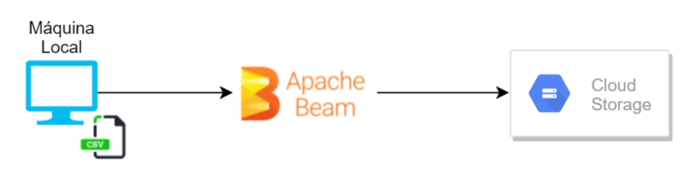

# my-first-apache
My first experiment with apache beam

## How to run?
You can choose any option below to run an Apache sample:

- ### Run `Apache_Beam_functions.ipynb`
Notebook with some examples of Apache Beam operations.

- ### Run `apache_local_to_gcp.py`

Starts a local pipeline similar to the Notebook example, but with storage on GCP.