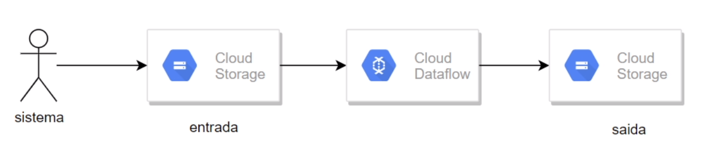

# my-first-apache
My first experiment with apache beam.

Note: dataset extracted from [here](https://raw.githubusercontent.com/cassiobolba/Python/master/Python-Apache-Beam/voos_sample.csv).

## How to run?
You can choose any option below to run an Apache sample:

### Run `Apache_Beam_functions.ipynb`
Notebook with some examples of Apache Beam operations.
___
### Run `apache_local_to_gcp.py`
 

A `DirectRunner` example that runs a pipeline on your local machine.

Starts a local pipeline similar to the Notebook example, but with storage on GCP.
___
### Run `generate_dataflow_template.py`
 

A `DataflowRunner` example that submit the pipeline to a Dataflow compute instance.
This instance can be a single virtual machine. This scritp don't run the pipeline, just
create the template on GCS.

# References
- https://www.udemy.com/course/engenharia-de-dados-com-apache-beam-google-dataflow-gcp/